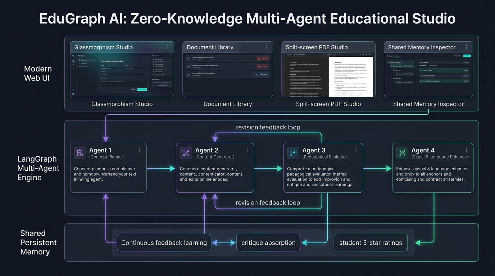
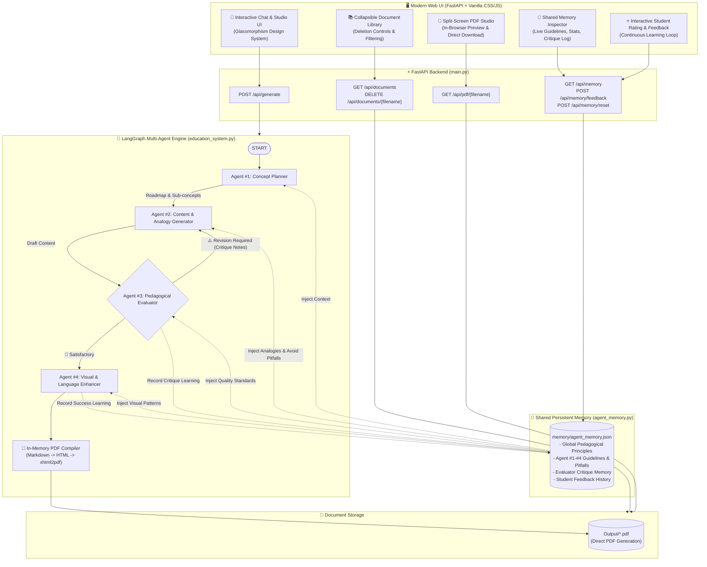

# 🎓 EduGraph AI — Zero-Knowledge Multi-Agent Learning Studio

[](https://www.python.org/)
[](https://fastapi.tiangolo.com/)
[](https://github.com/langchain-ai/langgraph)
[](./memory/agent_memory.json)
[](https://opensource.org/licenses/MIT)

**EduGraph AI** is an intelligent **LangGraph** multi-agent educational pipeline and **FastAPI** web application engineered to generate comprehensive, beginner-friendly learning guides and styled PDF documents for learners starting with **zero prior knowledge**. It features a **Shared Persistent Memory Engine** that continuously learns from pedagogical evaluator critiques and student star ratings over time.

---

## 🏛️ System Architecture





---

## 🌟 Key Features

- **Zero-Knowledge Pedagogical Engine**: Translates complex, abstract concepts into concrete, physical-world metaphors and stepwise milestones designed for complete beginners.
- **4-Agent LangGraph Workflow**: Specialized division of labor with an automated feedback loop between Agent #2 (Content Creator) and Agent #3 (Evaluator).
- **Shared Persistent Memory**: Continuous cross-agent learning saved in `memory/agent_memory.json` that distills evaluator critiques and student star ratings into actionable avoidance rules.
- **Dynamic Dark / Light Mode Theming**: One-click theme switcher featuring a curated **Black & Blue** palette for Dark mode (`#040711` / `#38bdf8`) and a crisp **White & Blue** palette for Light mode (`#ffffff` / `#1d4ed8`), with persistent state and dynamic syntax highlighting.
- **Split-Screen PDF Studio**: Real-time PDF preview right inside the browser alongside the generation chat.
- **Document Management**: Manage generated lessons with instant search, smooth collapse/expand navigation, and direct file deletion.
- **Clean Response Cards**: Streamlined completion cards showing concept milestones with immediate PDF actions and student feedback inputs.

---

## 🤖 The 4 Specialized Agents

| # | Agent | Role & Pedagogical Responsibilities |
|---|---|---|
| **1** | **🧠 Concept Planner** | Deconstructs the topic into a progressive zero-knowledge roadmap without circular dependencies or unexplained prerequisites. |
| **2** | **✍️ Content Generator** | Drafts comprehensive explanations anchored in relatable everyday analogies (e.g. kitchens, traffic, postal routes) and plain-English definitions. |
| **3** | **🔍 Pedagogical Evaluator** | Strict zero-jargon auditor verifying that every technical term is physically grounded; rejects and provides actionable critique notes if criteria are unmet. |
| **4** | **✨ Visual & Language Enhancer** | Polishes formatting, generates clean Mermaid flowcharts, structures callout blocks (`> 💡 Intuition`), and produces a publication-ready PDF. |

---

## 🧠 Shared Persistent Memory & Continuous Feedback Learning

EduGraph AI incorporates a cross-agent memory bank (`agent_memory.py` $\rightarrow$ `memory/agent_memory.json`):

1. **Persistent Pedagogical Guidelines**:
   - **Agent #1 (Concept Planner)**: Learned concept roadmaps, progressive prerequisite sequencing, and zero-assumption title formatting.
   - **Agent #2 (Content Generator)**: Proven analogy templates, plain-English definitions, and avoidance of domain jargon.
   - **Agent #3 (Pedagogical Evaluator)**: Strict zero-knowledge auditing standards, jargon-scanning rules, and actionable remediation feedback.
   - **Agent #4 (Visual Enhancer)**: Standardized Mermaid diagram workflows and callout quote formatting.

2. **Automated Critique Absorption**:
   - When Agent #3 rejects a draft, the critique is distilled into a succinct lesson and recorded in persistent memory so all agents avoid repeating the mistake on subsequent runs.

3. **Student / Human Feedback Loop**:
   - Learners can rate generated lessons (1–5 stars) and submit comments directly from the UI.
   - 5-star praise reinforces effective explanation patterns; constructive critique adds specific avoidance rules to agent memory.

4. **Live Memory Inspector Modal**:
   - In-app modal visualizes total lessons generated, critiques absorbed, active guidelines, student ratings, and detailed agent rule sets.

---

## 🔌 API Endpoints Reference

| Method | Endpoint | Description |
|---|---|---|
| `GET` | `/` | Serves the single-page interactive Chat, Document Library, & PDF Studio UI |
| `POST` | `/api/generate` | Generates educational content and PDF asynchronously (`{ "topic": "..." }`) |
| `GET` | `/api/documents` | Lists all available generated PDF lessons with metadata and file sizes |
| `DELETE` | `/api/documents/{filename}` | Deletes a generated PDF document from the `Output/` storage |
| `GET` | `/api/pdf/{filename}` | Streams the requested PDF with `inline` or `attachment` headers |
| `GET` | `/api/memory` | Returns memory stats, active guidelines, critique history, and student feedback |
| `POST` | `/api/memory/feedback` | Submits student ratings & comments, updating shared persistent memory |
| `POST` | `/api/memory/reset` | Resets persistent memory to baseline zero-knowledge seed rules |
| `GET` | `/api/health` | Service health status and API key configuration check |

---

## 🚀 Setup & Getting Started

### 1. Clone & Setup Environment
```bash
# Clone the repository
git clone https://github.com/aakashlokhande99/EduGraph-AI.git
cd EduGraph-AI

# Create and activate virtual environment
python -m venv .venv
.\.venv\Scripts\activate   # Windows
# source .venv/bin/activate # Linux / macOS

# Install dependencies
pip install -r requirements.txt
```

### 2. Configure API Keys
Create a `.env` file in the project root:
```env
# Gemini API Key (Recommended)
GOOGLE_API_KEY=your_gemini_api_key

# Or OpenAI API Key
# OPENAI_API_KEY=your_openai_api_key
```

### 3. Run the Application
```bash
uvicorn main:app --host 127.0.0.1 --port 8000 --reload
```

Open your browser at **[http://127.0.0.1:8000](http://127.0.0.1:8000)**.

---

## 🧪 Running Tests

Run the automated test suites verifying memory persistence, API endpoints, document deletion, and UI theme functionality:
```bash
# Verify shared persistent memory and LangGraph agent distillation
python test_memory_system.py

# Verify document deletion, collapse navigation, and Dark/Light mode theme system
python test_new_features.py
```

---

## 📁 Project Structure

```
├── assets/
│   └── architecture_diagram.png # System architecture infographic
├── memory/
│   └── agent_memory.json        # Persistent JSON storage for shared agent memory
├── templates/
│   └── index.html               # Single-page Chat, PDF Studio, & Memory Inspector UI
├── Output/                      # Destination directory for generated PDF documents
├── agent_memory.py              # Shared Persistent Memory Engine & feedback learning
├── education_system.py          # LangGraph 4-agent workflow with memory injection & PDF engine
├── main.py                      # FastAPI server & REST API endpoints (generation, memory, files)
├── test_memory_system.py        # Unit and integration test suite
├── requirements.txt             # Project dependencies
├── .env                         # Environment variables & API keys
└── README.md                    # Project documentation
```

---

## 📄 License

This project is licensed under the MIT License — see the [LICENSE](LICENSE) file for details.
