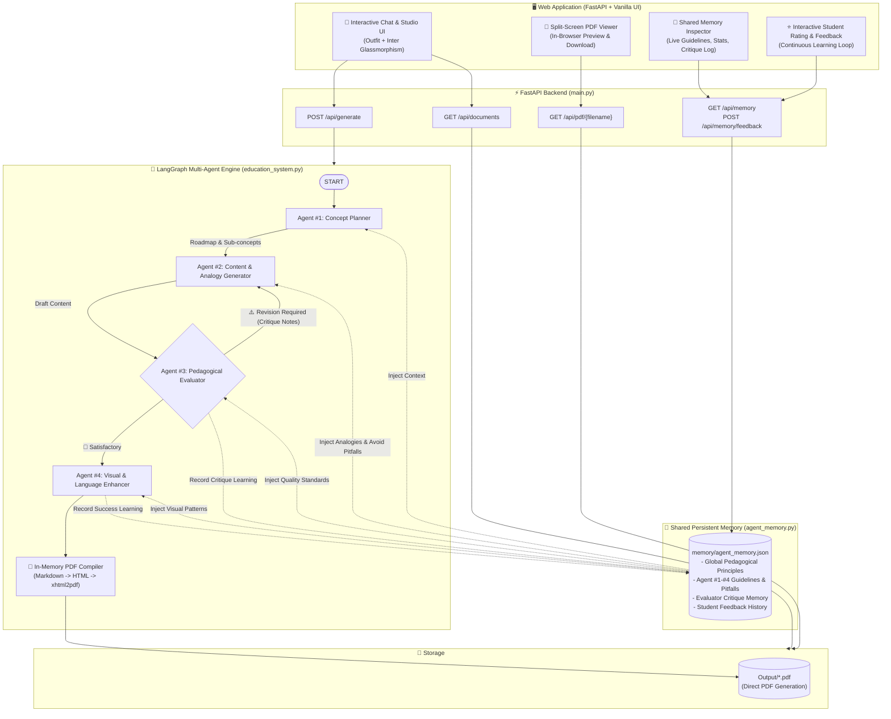

# 🎓 EduGraph AI — Zero-Knowledge Multi-Agent Learning Studio

A **LangGraph** multi-agent educational pipeline and **FastAPI** web application designed to generate comprehensive, beginner-friendly learning guides and styled PDF documents for learners starting with **zero prior knowledge**, powered by **Shared Persistent Memory** for continuous feedback learning over time.

---

## 🏛️ System Architecture



---

## 🧠 Shared Persistent Memory & Feedback Learning

EduGraph AI incorporates a cross-agent memory bank (`agent_memory.py` $\rightarrow$ `memory/agent_memory.json`) that learns from every generation and feedback cycle:

1. **Persistent Pedagogical Guidelines**:
   - **Agent #1 (Concept Planner)**: Learned concept roadmaps, progressive prerequisite sequencing, and zero-assumption title formatting.
   - **Agent #2 (Content Generator)**: Proven analogy models (kitchens, traffic, post offices), plain-English definitions, and avoidance of domain jargon.
   - **Agent #3 (Pedagogical Evaluator)**: Strict zero-knowledge auditing standards, jargon-scanning rules, and actionable remediation feedback.
   - **Agent #4 (Visual Enhancer)**: Standardized Mermaid diagram workflows and category-specific callout quotes (`> 💡 Intuition`, `> 🎯 Example`, `> ⚠️ Pitfall`).

2. **Automated Critique Absorption**:
   - When Agent #3 rejects a draft, the critique is distilled into a succinct lesson and recorded in persistent memory so all agents avoid repeating the mistake on subsequent runs.

3. **Student / Human Feedback Loop**:
   - Learners can rate generated lessons (1–5 stars) and submit comments directly from the UI.
   - Praise reinforces effective explanation patterns; constructive critique adds specific avoidance rules to agent memory.

4. **Live Memory Inspector & Statistics**:
   - In-app modal visualizes total lessons generated, critiques absorbed, active guidelines, student ratings, and detailed agent rule sets.

---

## 🤖 Agent Roles & Multi-Agent Pipeline

1. **🧠 Agent #1: Concept Planner**: Deconstructs the topic into a progressive zero-knowledge roadmap.
2. **✍️ Agent #2: Content & Analogy Generator**: Drafts comprehensive lessons with concrete real-world analogies.
3. **🔍 Agent #3: Pedagogical Evaluator**: High-standard auditor verifying clarity, analogies, and smooth flow; loops back to Agent #2 if revisions are required.
4. **✨ Agent #4: Visual & Language Enhancer**: Formats content with Mermaid flowcharts, tables, callout blocks, and conversational polish.
5. **📄 In-Memory PDF Engine**: Renders styled A4 PDF documents directly into `Output/`.

---

## 🔌 API Endpoints Reference

| Method | Endpoint | Description |
|---|---|---|
| `GET` | `/` | Serves the single-page interactive Chat & PDF Studio web UI |
| `POST` | `/api/generate` | Generates educational content and PDF asynchronously (`{ "topic": "..." }`) |
| `GET` | `/api/documents` | Lists all available generated PDF lessons with metadata and file sizes |
| `GET` | `/api/pdf/{filename}` | Streams the requested PDF with `inline` or `attachment` headers |
| `GET` | `/api/memory` | Returns memory stats, active guidelines, critique history, and student feedback |
| `POST` | `/api/memory/feedback` | Submits student ratings & comments, updating shared persistent memory |
| `POST` | `/api/memory/reset` | Resets persistent memory to baseline zero-knowledge seed rules |
| `GET` | `/api/health` | Service health status and API key configuration check |

---

## 🚀 Setup & Getting Started

```bash
# 1. Activate virtual environment
.\.venv\Scripts\activate

# 2. Install dependencies
pip install -r requirements.txt

# 3. Configure .env
GOOGLE_API_KEY=your_gemini_api_key
# or OPENAI_API_KEY=your_openai_api_key

# 4. Start the server
uvicorn main:app --host 127.0.0.1 --port 8000 --reload
```

Open your browser at **[http://127.0.0.1:8000](http://127.0.0.1:8000)**.

---

## 📁 Project Structure

```
├── agent_memory.py          # Shared Persistent Memory Engine & feedback learning
├── education_system.py      # LangGraph 4-agent workflow with memory injection & PDF engine
├── main.py                  # FastAPI server & REST API endpoints (generation, memory, files)
├── templates/
│   └── index.html           # Single-page Chat, PDF Studio, & Memory Inspector UI
├── memory/
│   └── agent_memory.json    # Persistent JSON storage for shared agent memory
├── Output/                  # Destination directory for generated PDF documents
├── requirements.txt         # Project dependencies
├── .env                     # Environment variables & API keys
└── README.md                # Project documentation
```
