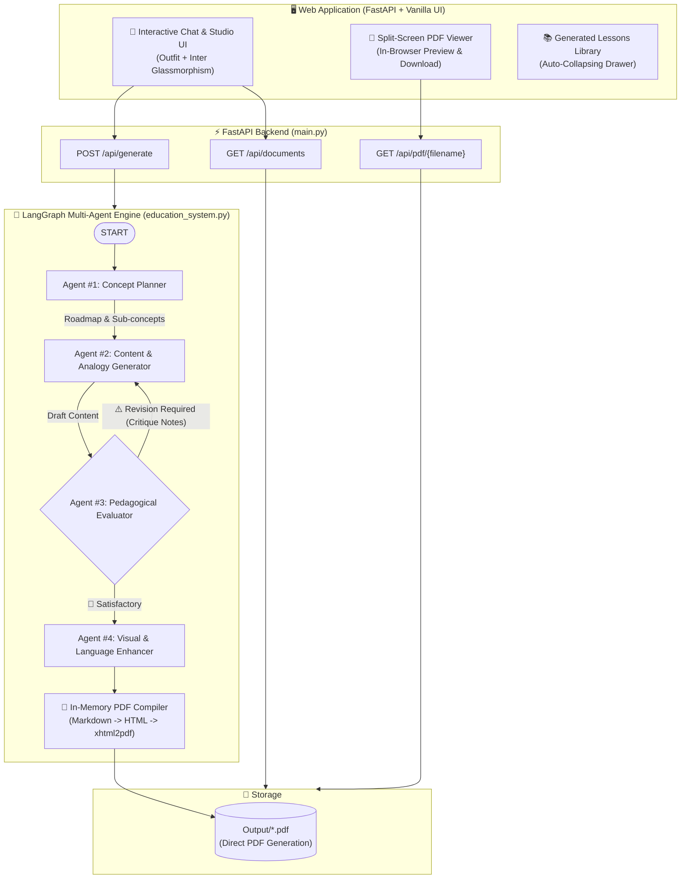

# 🎓 EduGraph AI — Zero-Knowledge Multi-Agent Educational Studio

A **LangGraph** multi-agent educational pipeline and **FastAPI** web application designed to generate comprehensive, beginner-friendly learning guides and styled PDF documents for learners starting with **zero prior knowledge**.

---

## 🏛️ System Architecture



---

## 🤖 Agent Roles & Multi-Agent Pipeline

The generation pipeline coordinates 4 specialized agents in a recursive state graph:

1. **🧠 Agent #1: Concept Planner**
   - Deconstructs the input topic into an intuitive step-by-step learning roadmap.
   - Breaks concepts down into granular sub-concepts tailored for an absolute beginner with zero background knowledge.

2. **✍️ Agent #2: Content & Analogy Generator**
   - Drafts the comprehensive educational lesson.
   - Explains core concepts using relatable real-world analogies (cooking, sports, daily life) and concrete step-by-step examples.
   - Incorporates critique feedback from Agent #3 when looped for revision.

3. **🔍 Agent #3: Pedagogical Evaluator (Quality Auditor)**
   - Audits the draft against 4 strict beginner criteria: *Zero-Knowledge Accessibility*, *Intuitive Analogies*, *Concrete Examples*, and *Logical Flow*.
   - Uses structured Pydantic outputs (`EvaluationResult`).
   - If satisfactory $\rightarrow$ routes forward to Agent #4.
   - If unsatisfactory $\rightarrow$ generates constructive critique notes and loops back to Agent #2.

4. **✨ Agent #4: Visual & Language Enhancer**
   - Applies Markdown structure, stylized callout boxes (`> 💡 Key Concept`, `> ⚠️ Common Pitfall`), and visual Mermaid / ASCII diagrams.
   - Polishes language to ensure an engaging, conversational, and intuitive tone.

5. **📄 In-Memory PDF Engine (`convert_markdown_text_to_pdf`)**
   - Converts the finalized Markdown content directly to a styled A4 PDF document in memory using `xhtml2pdf`.
   - Saves only the PDF document to the `Output/` folder without writing intermediate `.md` files to disk.

---

## 💻 Web Application Features (`main.py`)

- **Interactive Multi-Agent Chat**: Real-time progress visualizer simulating active agent stages (Roadmap -> Drafting -> Audit -> Visuals).
- **Split-Screen PDF Studio**: In-app embedded PDF viewer with one-click full-screen toggle, download, and new-tab preview.
- **Auto-Collapsing Lessons Library**: Side drawer indexing all previously generated PDFs in `Output/` with instant search filter; clicking any lesson tile automatically loads the PDF and collapses the sidebar to maximize reading area.
- **Dark Glassmorphism Design**: High-aesthetic UI featuring Outfit & Inter typography, glowing neon accents, and responsive layout.

---

## 🔌 API Endpoints Reference

| Method | Endpoint | Description |
|---|---|---|
| `GET` | `/` | Serves the single-page interactive Chat & PDF Studio web UI |
| `POST` | `/api/generate` | Generates educational content and PDF asynchronously (`{ "topic": "..." }`) |
| `GET` | `/api/documents` | Lists all available generated PDF lessons with metadata and file sizes |
| `GET` | `/api/pdf/{filename}` | Streams the requested PDF with `inline` or `attachment` headers |
| `GET` | `/api/health` | Service health status and API key configuration check |

---

## 📦 Python Module Usage

`education_system.py` can be imported as a module in any Python application:

```python
import education_system

# 1. Generate educational lesson and PDF
result = education_system.generate_educational_content(
    topic="What is DNS",
    output_folder="Output",
    recursion_limit=15
)

print(result["topic"])
print(result["pdf_path"])       # e.g., Output/education_what_is_dns.pdf
print(result["revision_count"]) # Number of evaluator revision cycles
print(result["final_content"])  # Final polished Markdown text

# 2. Retrieve available generated documents
docs = education_system.get_available_documents(output_folder="Output")
for doc in docs:
    print(f"- {doc['title']} ({doc['size_kb']} KB) -> {doc['pdf_path']}")
```

---

## 🚀 Setup & Getting Started

### 1. Clone & Install Dependencies

```bash
git clone <repository-url>
cd GenAI_NxtWave

# Create & activate virtual environment (optional)
python -m venv .venv
.\.venv\Scripts\activate

# Install dependencies
pip install -r requirements.txt
```

### 2. Configure API Keys

Create or edit your `.env` file with either OpenAI or Google Gemini API keys:

```env
# Google Gemini (Recommended)
GOOGLE_API_KEY=your_gemini_api_key

# or OpenAI
OPENAI_API_KEY=your_openai_api_key
```

### 3. Run the Web Application

```bash
# Start FastAPI application with Uvicorn
python main.py
# or
uvicorn main:app --host 127.0.0.1 --port 8000 --reload
```

Open your browser at **[http://127.0.0.1:8000](http://127.0.0.1:8000)**.

### 4. Run via CLI (Optional)

```bash
# Generate a lesson directly from command line
python education_system.py "How Docker Containers Work"
```

---

## 📁 Project Structure

```
├── education_system.py      # Core LangGraph 4-agent workflow & PDF compiler
├── main.py                  # FastAPI server & REST API endpoints
├── templates/
│   └── index.html           # Single-page Chat & PDF Studio web UI
├── Output/                  # Destination directory for generated PDF documents
├── requirements.txt         # Project dependencies
├── .env                     # Environment variables & API keys
└── README.md                # Project documentation
```
